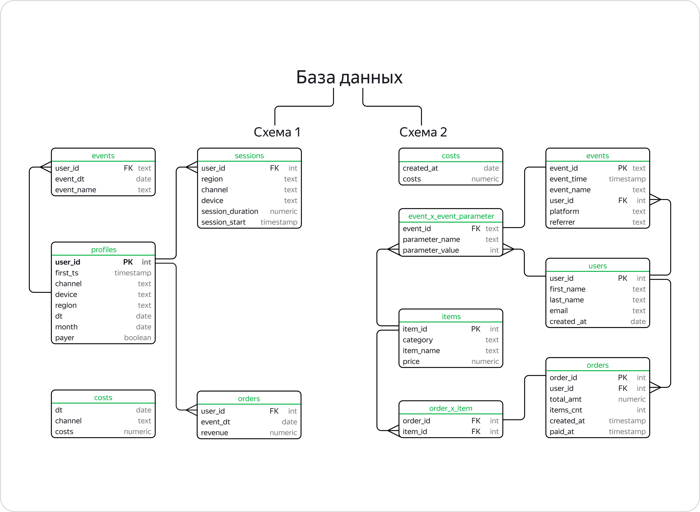

# SQL запросы

Здесь я собрал некоторые SQL запросы, в каждом из которых я использовал различные виды функций для демонстрации умений.

Первая база данных с которой я работал содержит информацию о венчурных фондах и инвестияциях в стартапы. <br>
Ниже приведена её ER-диаграмма:
.

## Агрегирующие функции. Группировка и сортировка данных.

**Задание.** \
Выгрузите таблицу с десятью самыми активными инвестирующими странами. Активность страны определите по среднему количеству компаний, в которые инвестируют фонды этой страны.

Для каждой страны посчитайте минимальное, максимальное и среднее число компаний, в которые инвестировали фонды, основанные с 2010 по 2012 год включительно.

Исключите из таблицы страны с фондами, у которых минимальное число компаний, получивших инвестиции, равно нулю. Отсортируйте таблицу по среднему количеству компаний от большего к меньшему, а затем по коду страны в лексикографическом порядке.

```sql
SELECT country_code,
       MAX(invested_companies),
       MIN(invested_companies),
       AVG(invested_companies)
FROM fund
WHERE EXTRACT(YEAR FROM founded_at) BETWEEN 2010 AND 2012
GROUP BY country_code
HAVING MIN(invested_companies) <> 0
ORDER BY AVG(invested_companies) DESC
LIMIT 10
```
Вывод получился в следующем формате:

|country_code	| max	| min	| avg |
|:-----------:|----:|----:|----:|
|BGR|35| 25|30 |
|CHL|29| 29| 29|
|UKR|10|8  |	9|
|LTU|	5|	5|	5|
|IRL|	5|	4|4.5|
|KEN|	3|	3|	3|

## Подзапросы и временные запросы. Объединение таблиц

**Задание.** <br>
Выведите среднее число учебных заведений (всех, не только уникальных), которые окончили сотрудники Facebook.

```sql
WITH 
  tb AS (SELECT DISTINCT co.id as co_id
         FROM company as co
         JOIN funding_round as fr ON co.id = fr.company_id
         WHERE co.name = 'Facebook'),
  tb2 AS (SELECT people.id,
                 COUNT(e.instituition) as inst
          FROM people
          JOIN education as e ON people.id = e.person_id
          GROUP BY people.id),
  tb3 AS (SELECT DISTINCT people.id,
                 tb2.inst
          FROM people
          JOIN tb ON tb.co_id = people.company_id
          JOIN tb2 ON tb2.id = people.id
          JOIN education as e ON e.person_id = people.id)

SELECT AVG(inst)
FROM tb3
```
|avg|
|:-:|
|1.51111|

**Задание.** <br>
Составьте сводную таблицу и выведите среднюю сумму инвестиций для стран, в которых есть стартапы, зарегистрированные в 2011, 2012 и 2013 годах. 

Данные за каждый год должны быть в отдельном поле. 

Отсортируйте таблицу по среднему значению инвестиций за 2011 год от большего к меньшему.

```sql
WITH
     inv_2011 AS (SELECT country_code,
				         AVG(funding_total) AS year_2011
				  FROM company
				  WHERE EXTRACT(YEAR FROM founded_at) = 2011
				  GROUP BY country_code),
	 inv_2012 AS (SELECT country_code,
				         AVG(funding_total) AS year_2012
				  FROM company
				  WHERE EXTRACT(YEAR FROM founded_at) = 2012
				  GROUP BY country_code),
	 inv_2013 AS (SELECT country_code,
				         AVG(funding_total) AS year_2013
				  FROM company
				  WHERE EXTRACT(YEAR FROM founded_at) = 2013
				  GROUP BY country_code)	
SELECT inv_2011.country_code,
       inv_2011.year_2011,
	   inv_2012.year_2012,
	   inv_2013.year_2013
FROM inv_2011 
INNER JOIN inv_2012 ON inv_2011.country_code = inv_2012.country_code
INNER JOIN inv_2013 ON inv_2012.country_code = inv_2013.country_code
ORDER BY inv_2011.year_2011 DESC
```
На выходе получили:

|country_code	|year_2011	|year_2012	|year_2013|
|:---|:---|:---|:---|
|PER	|4e+06	|41000	|25000|
|USA	|2.24396e+06	|1.20671e+06	|1.09336e+06|
|HKG	|2.18078e+06	|226227	|0|
|PHL	|1.75e+06	|4218.75	|2500|
|ARE	|1.718e+06	|197222	|35333.3|
|JPN	|1.66431e+06	|674720	|50000|

## Оконные функции

Вторая база данных - база данных магазина - содержит информацию о покупателях, покупках, товарах и событиях.


**Задание с NTILE()** <br>
Разбейте пользователей в таблице tools_shop.users на пять групп так, чтобы в первую группу попали пользователи, которые недавно зарегистрировались.
```sql
SELECT user_id,
       created_at,
       NTILE(5) OVER(ORDER BY created_at DESC)
FROM tools_shop.users
```

**Задание с ROW_NUMBER()** <br>
Выведите все поля таблицы tools_shop.orders и проранжируйте заказы для каждого клиента в зависимости от даты оплаты заказа — от меньшей к большей.

```sql
SELECT *,
       ROW_NUMBER() OVER(PARTITION BY user_id ORDER BY paid_at)
FROM tools_shop.orders
```

**Задание с агрегирующими оконными функциями** <br>
Рассчитайте общую выручку в таблице tools_shop.orders по месяцам. Выведите все поля таблицы и новое поле с суммой выручки.

```sql
SELECT *,
       SUM(total_amt) OVER(PARTITION BY DATE_TRUNC('MONTH', created_at))
FROM tools_shop.orders
```

**Задание с расчетом кумулятивных значений** <br>
Напишите запрос к таблице tools_shop.orders, который выведет:
  * месяц заказа в формате '2016-02-01', приведённый к типу date;
  * сумму заказа total_amt;
  * сумму заказа с накоплением, отсортированную по возрастанию месяца оформления заказа (здесь дата — дата и время, усечённые до месяца).

```sql
SELECT CAST(DATE_TRUNC('MONTH', created_at) as date),
       total_amt,
       SUM(total_amt) OVER(ORDER BY DATE_TRUNC('MONTH', CAST(created_at as date)))
FROM tools_shop.orders    
```

**Задание на функции смещения** <br>
Выведите поля event_id, event_time, user_id из таблицы tools_shop.events и к ним добавьте поле с количеством дней до следующего события.

```sql
SELECT event_id,
       event_time,
       user_id,
       LEAD(event_time) OVER(PARTITION BY user_id ORDER BY event_time) - event_time
FROM tools_shop.events
```
